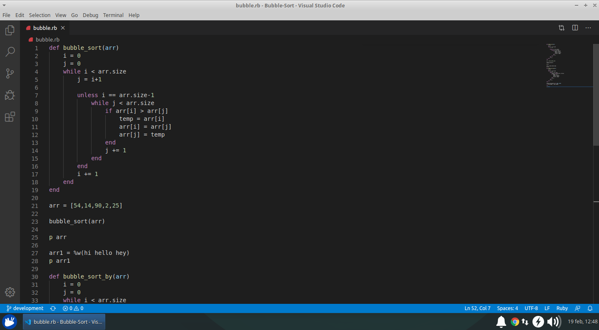

# Bubble-Sort
This is the first project in Microverse Ruby Curriculum. We are required to create a bubble sorting algorithm and implement yield in our method

## Screenshots

## Built with
- Ruby
- Visual Studio Code

## Author
This project was created by [Alfredo Elizarrarás](https://github.com/AlfredoElizarraras) and [Julian Blasco](https://github.com/Blasco9)
